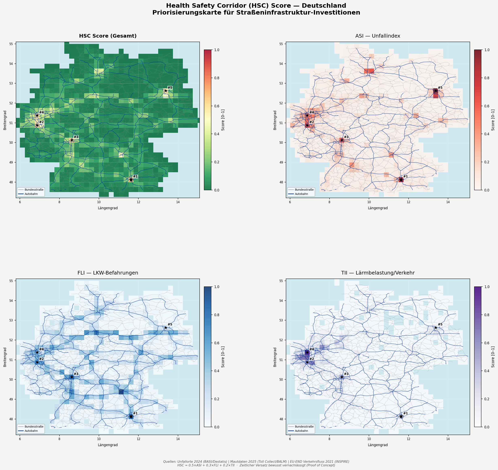

# Health Safety Corridor (HSC) Score

> **Team PriStIn** — _Priorisierung von Straßeninfrastruktur_  
> Hackathon project exploring how publicly available Toll Collect toll data can be turned into societal value.

The **HSC Score** is a spatial prioritisation index for German road infrastructure. It aggregates accident severity, freight load, and traffic intensity into a single cell-level score across Germany, answering the question: _Where does road infrastructure need the most attention?_

The results are visualised as a static 4-panel PNG and a fully interactive web map.

---

## Preview



Open `index.html` in a browser (or go to https://gxstxxv.github.io/hfc/) for the interactive version with corridor filters, per-cell popups, and a dynamic legend.

---

## Concept

Germany is divided into a **0.25° × 0.25° grid** (~28 km × 20 km per cell). Three indices are computed per cell, min-max normalised to \[0, 1\], and combined into the HSC Score:

```
HSC = 0.5 × ASI_n + 0.3 × FLI_n + 0.2 × TII_n
```

| Index | Name                    | Weight | Source                   |
| ----- | ----------------------- | ------ | ------------------------ |
| ASI   | Accident Severity Index | 50 %   | BASt Unfallorte 2024     |
| FLI   | Freight Load Index      | 30 %   | Toll Collect / BALM 2025 |
| TII   | Traffic Intensity Index | 20 %   | EU END / INSPIRE 2022    |

A **high HSC Score** signals that a region combines frequent severe accidents, heavy freight traffic, and high road-noise exposure — a strong indicator that public investment is urgently needed there.

---

## Indices

### ASI — Accident Severity Index

Each accident is weighted by three multipliers drawn from the official accident catalogue:

| Factor            | Attribute    | Weights                                          |
| ----------------- | ------------ | ------------------------------------------------ |
| Accident category | `UKATEGORIE` | Fatal: 10 · Serious injury: 3 · Slight injury: 1 |
| Light conditions  | `ULICHTVERH` | Daylight: 1.0 · Dusk/dawn: 1.3 · Dark: 1.6       |
| Road surface      | `STRZUSTAND` | Dry: 1.0 · Wet: 1.2 · Slippery: 1.5              |

```
ASI_cell = Σ (W_category × W_light × W_road)   for all accidents in cell
ASI_n    = min-max normalise(ASI_cell)
```

### FLI — Freight Load Index

Based on anonymised toll data from Toll Collect, capturing the number of heavy vehicle passages per toll segment and segment length.

```
FLI_cell = Σ (passages × length_km)   for all toll segments with centroid in cell
FLI_n    = min-max normalise(FLI_cell)
```

### TII — Traffic Intensity Index

Derived from EU Environmental Noise Directive (END) reporting data. Used as a proxy for both traffic density and noise exposure. Coordinates are transformed from ETRS89-LAEA (EPSG:3035) to WGS84.

```
TII_cell = Σ (annualTrafficFlow / 365 × length_km)   for all noise segments in cell
TII_n    = min-max normalise(TII_cell)
```

---

## Corridor Classification

The interactive map highlights three named corridor types derived from threshold rules on the normalised indices:

| Corridor                  | Colour   | Trigger condition           | Interpretation                                                          |
| ------------------------- | -------- | --------------------------- | ----------------------------------------------------------------------- |
| **Safety Corridor**       | Orange   | ASI_n > 0.6                 | High accident severity — structural or behavioural road safety problem  |
| **Health-Noise Corridor** | Teal     | TII_n > 0.5 and ASI_n ≤ 0.6 | Noise and traffic exposure dominate without a matching accident hotspot |
| **Multi-Stress Corridor** | Dark red | HSC > 0.7                   | All three dimensions are elevated — highest priority for intervention   |

---

## Weighting Rationale

The 50 / 30 / 20 split reflects the following reasoning:

- **ASI (50 %)** — Direct human harm is the primary criterion for prioritising public spending. Accident data from BASt is high quality, spatially precise, and up to date (2024).
- **FLI (30 %)** — Heavy freight traffic is the dominant driver of road surface degradation and directly linked to the Toll Collect mandate. The data is fresh (April 2025) and covers the entire toll network.
- **TII (20 %)** — Traffic intensity adds a secondary dimension (noise exposure, indirect wear) but the EU END dataset (2022) has lower spatial resolution and the noise proxy is less direct. Its weight is kept conservative.

All three weights are parameters in the code and can be adjusted for scenario analysis.

---

## Data Sources

| Dataset                             | Provider                      | Date       | Licence                                     |
| ----------------------------------- | ----------------------------- | ---------- | ------------------------------------------- |
| `unfallorte_2024.xlsx`              | Statistische Ämter / BASt     | 2024       | Open Government Data                        |
| `verkehrsbelastung_2025-04-12.xlsx` | Toll Collect / BALM           | April 2025 | Datenlizenz Deutschland – Namensnennung 2.0 |
| `laermbelastung_2022.csv`           | EU END / INSPIRE (via UBA)    | 2022       | INSPIRE Open Data                           |
| `germany_outline.geojson`           | Natural Earth / OpenStreetMap | —          | ODbL                                        |

> **Temporal mismatch:** The three datasets span 2022–2025. For this proof-of-concept the temporal difference is accepted; a production system should align reporting periods.

---

## Data Quality & Limitations

- **Toll coverage only:** FLI covers vehicles > 3.5 t on toll roads. Smaller trucks, non-motorway roads without tolls, and exempt vehicles are not captured.
- **Rounding / anonymisation:** Toll passage counts are rounded to the nearest 10; values below 5 appear as 0.
- **Noise proxy:** TII is derived from EU END traffic flow figures, not direct noise measurements (dB). It approximates exposure but is not a substitute for actual noise mapping.
- **Grid resolution:** 0.25° cells (~28 × 20 km) smooth out local hotspots. A finer grid (0.05°) would improve spatial precision but requires denser data.
- **Single-day snapshot:** FLI reflects one reference day (12 April 2025). Seasonal or weekly variation is not captured.
- **No causal modelling:** The HSC Score is a descriptive composite index, not a causal model. High scores indicate co-occurrence of the three factors, not a proven causal chain.

---

## Project Structure

```
hackathon/
├── hfc_score.py          # Main script — data loading, score computation, visualisation
├── hsc_score_map.png     # Static 4-panel output (for pitch slides)
├── index.html            # Interactive Folium map (open in browser)
├── README.md
└── data/
    ├── unfallorte_2024.xlsx
    ├── verkehrsbelastung_2025-04-12.xlsx
    ├── laermbelastung_2022.csv
    ├── germany_outline.geojson
    └── description/
        ├── unfallorte.pdf
        └── verkehrsbelastung.txt
```

---

## Setup & Usage

**Requirements:** Python 3.10+

```bash
pip install numpy matplotlib folium contextily pyproj openpyxl
```

**Run:**

```bash
python hfc_score.py
```

Outputs `hsc_score_map.png` and `hsc_score_map.html` in the working directory.

**Adjusting weights:**

```python
# in hfc_score.py — compute_hfc()
hsc, asi_n, fli_n, tii_n = compute_hfc(asi, fli, tii,
                                         alpha=0.5,   # ASI weight
                                         beta=0.3,    # FLI weight
                                         gamma=0.2)   # TII weight
```

---

## Hackathon Context

This project was developed during a hackathon exploring the question:

> _"How can publicly available toll data from Toll Collect be used to create societal value?"_

The HSC Score demonstrates one concrete answer: by combining toll-based freight load data with accident and noise data, it is possible to build a transparent, reproducible prioritisation signal that could help federal authorities allocate road maintenance budgets more effectively.

---

## Team

**PriStIn** — _Priorisierung von Straßeninfrastruktur_

---

## Licence

Code: MIT  
Data: see individual licences in the table above.
